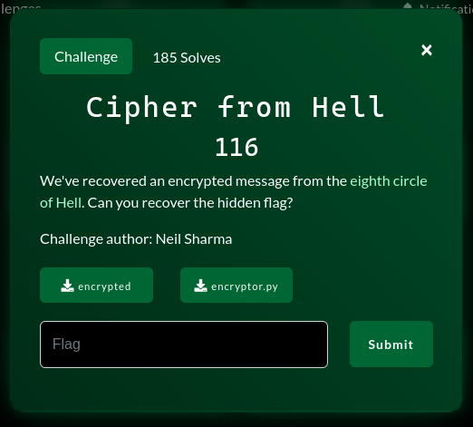

# Cipher from Hell



### Mô tả Challenge:

Challenge cung cấp một đoạn python dùng để mã hóa flag. Nhiệm vụ của chúng ta là đảo ngược thuật toán này để khôi phục flag.

Đây không phải là một dạng mã tiêu chuẩn, mà là 1 dạng mã tùy chỉnh:

- Flag -> số nguyên lớn -> base-3 -> base-9 -> số ngyên lớn -> lưu file

---

### Phân tích mã nguồn:

```py
import math
import sys

inp = input("Enter your flag... ").encode()

s = int.from_bytes(inp)

o = ((6, 0, 7), (8, 2, 1), (5, 4, 3))  # base-9

c = math.floor(math.log(s, 3))  # tính chỉ số cao nhất trong biểu diễn base-3 của s

if not c % 2:
    sys.stderr.write(
        "Error: flag length needs to be even (hint: but in what base system?)!\n"
    )
    sys.exit(1)

ss = 0

while c > -1:
    ss *= 9
    ss += o[s // 3**c][
        s % 3
    ]  # o[hi][lo] (hi, lo là số bên trái, phải nhất trong base-3)

    s -= s // 3**c * 3**c  # xóa hi
    s //= 3  # xóa lo
    c -= 2  # trừ đi 1 cặp

open("encrypted", "wb").write(
    ss.to_bytes(math.ceil(math.log(ss, 256)), byteorder="big")
)
```

Flag được chuyển thành số nguyên `s` bằng `int.from_bytes(inp)`

- `s` được coi là một chuỗi chữ số trong hệ 3
- Mỗi vòng lặp:
  - Lấy chữ số trái nhất: `hi = s // 3**c`
  - Lấy chữ số phải nhất: `lo = s % 3`
  - Dùng bảng `o` để biến `(hi, lo)` thành 1 chữ số base-9
  - Ghép vào `ss` bằng công thức base-9: `ss = ss * 9 + digit`
  - Xóa 2 chữ số vừa dùng: đầu + cuối
  - Giảm c -= 2

Do bảng o là ánh xạ 1-1 -> thuật toán hoàn toàn đảo ngược được.

---

### Chiến lược giải mã:

Để giải mã `ss` -> flag:

- Tách `ss` thành các chữ số trong hệ 9 bằng `divmod(ss, 9)`
- Dùng bảng đảo của `o` để lấy lại `(hi, lo)`
- Ghép `hi` và `lo` theo đúng thứ tự
- Ghép thành dãy chữ số base-3 ban đầu
- Chuyển dãy này thành số nguyên `s`
- Chuyển `s` -> bytes -> flag

---

### Script:

```py
#! /usr/bin/env python3

import math

def int_to_bytes_auto(n: int) -> bytes:
    if n == 0:
        return b"\x00"
    length = (n.bit_length() + 7) // 8  # số byte tối thiểu
    return n.to_bytes(length, "big")


file = "encrypted"

with open(file, "rb") as f:
    data = f.read()

ss = int.from_bytes(data, "big")  # đưa về int

o = ((6, 0, 7), (8, 2, 1), (5, 4, 3))

# đảo ngược o
index_o = {}
for hi in range(3):
    for lo in range(3):
        v = o[hi][lo]  # digit ở hệ 9
        index_o[v] = (hi, lo)  # Ngược: digit -> (hi, lo)

# Tách từng digit base-9
digits9 = []
x = ss
while x > 0:
    x, d = divmod(x, 9)
    digits9.append(d)

digits9 = digits9[::-1]

# từ digit base-9 -> (hi,lo)
his = []
los = []
for v in digits9:
    hi, lo = index_o[v]  # Map ngược
    his.append(hi)
    los.append(lo)

# Ghép digit base-3
digits3 = his + los[::-1]

# Từ digit base-3 -> số nguyên base-10
s = 0
for d in digits3:
    s = s * 3 + d

b = int_to_bytes_auto(s)
flag = b.decode()

print(flag)
```

`pctf{a_l3ss_cr4zy_tr1tw1s3_op3r4ti0n_f37d4b}`
