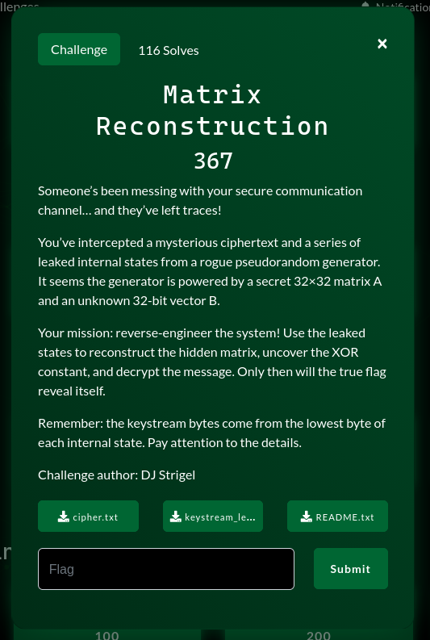

# Matrix Reconstruction



### Mổ tả Challenge:

**Mục tiêu:** Giải mã file cipher.txt bằng cách tái tạo ma trận chuyển trạng thái A và vector B của bộ sinh số giả ngẫu nhiên (PRNG)

**Mô hình toán học:** $S_{n+1} = A \cdot S_n \oplus B$ trên $GF(2)$

**Quy tắt keystream:** Keystream byte $(K)$ được lấy từ **byte thấp nhất** của trạng thái nội bộ $(S)$

---

### Phân tích:

Nhận diện hệ thống: Xác định đây là 1 bộ sinh số **Affine LPRNG** $(A \cdot S + B)$ và cần dùng đại số tuyến tính trên $GF(2)$

Mục tiêu tái tạo: Để tìm $A$ và $B$, cần dùng phương trình $\Delta S_{n+1} = A \cdot \Delta S_n$ và $A$ là ma trận $32 \times 32$

Phát hiện cái bẫy:

- Thông thường, cần tìm $A,B$ để sinh ra trạng thái tiếp theo $(S_{40}, S_{41},...)$
- Tuy nhiên, ciphertext chỉ dài 35 bytes, trong khi file `keystream_leak.txt` đã có sẵn 40 trạng thái
- **Kết luận:** Ciphertext không phải được mã hóa bằng trạng thái tương lai, mà bằng chính các trạng thái rỏ rỉ $(S_{0}, S_{1},...)$

---

### Chiến lược giải mã:

Cơ chế giải mã: Dùng công thức mã hóa dòng cơ bản: $Plaintext = Ciphertext \oplus Keystream$

**Trích xuất Khóa (Keystream Generation):** Khóa dòng $K_{i}$ được lấy từ trạng thái rỏ rỉ $S_{i}$ bằng cách: Che toàn bộ 24 bit đầu và giữ lại 8 bit cuối

- Code: `Key = state & 0xFF`

**Thực hiện giải mã**: Sử dụng hàm `zip()` để ghép cặp từng byte của ciphertext với byte khóa tương ứng, sau đó XOR để lấy bản rõ.

---

### Script:

```py
#! /usr/bin/env python3

nums = open('keystream_leak.txt', 'r').read().splitlines()
nums = list(map(int, nums))
cypher = list(open('cipher.txt', 'rb').read())
flag = [(num & 255) ^ b for num, b in zip(nums, cypher)]
print(bytes(flag))
```

`pctf{mAtr1x_r3construct?on_!s_fu4n}`
