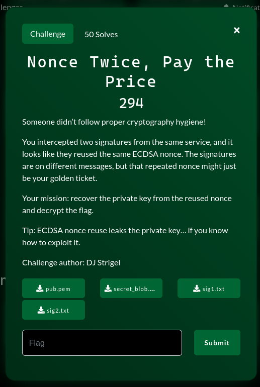

# Nonce Twice, Pay the Price



### Mô tả challenge:

Đề cho các file sau:

- `pub.pem`: Public Key dạng ECC (Curve SECP256k1)
- `sig1.txt` và `sig2.txt`: Hai chữ ký ECDSA gồm các cặp giá trị $(r, s)$ và mã băm thông điệp `msg_hash`
- `secret_blob.bin`: Một file nhị phân bí ẩn chứa Flag đã bị mã hóa

---

### Phân tích:

`Quan sát quan trọng:` Khi kiểm tra nội dung của hai file chữ ký, ta thấy giá trị $r$ hoàn toàn giống nhau:

```
r: 288b415d6703ba7a2487681b10da092d991a2ef7d10de016daea4444523dc792
```

Trong ECDSA, $r$ được tính từ số ngẫu nhiên $k$ (nonce). Việc $r$ giống nhau nghĩa là `Nonce` $k$ `đã bị tái sử dụng`. Đây là lỗ hổng kinh điển cho phép khôi phục Private Key

##### Khôi phục private key:

Với thuật toán ECDSA, chữ ký $(r, s)$ được tạo ra bởi công thức:
$$s = k^{-1}(z + r \cdot d) \pmod n$$

Trong đó:

- $z$: Message Hash (số nguyên)
- $d$: Private Key
- $k$: Nonce (bí mật)
- $n$: Order của đường cong SECP256k1.

Khi có 2 chữ ký sử dụng cùng $k$, ta có hệ phương trình:

- $s_1 = k^{-1}(z_1 + r \cdot d) \pmod n$
- $s_2 = k^{-1}(z_2 + r \cdot d) \pmod n$

Lấy $(1) - (2)$ để triệt tiêu $d$, ta tìm được $k$:
$$k = (z_1 - z_2) \cdot (s_1 - s_2)^{-1} \pmod n$$

Áp dụng vào code Python, ta khôi phục được private Key ($d$):
`0x3d5d238dfd8ccd1472cd22f80e22ae57e9ad79d779f4630930efb5cc21977ce7`

##### Giải mã Secret Blob

File `secret_blob.bin` có kích thước 43 bytes. Đây là kích thước khá lạ (số nguyên tố, không chia hết cho 16), gợi ý rằng thuật toán mã hóa là Stream Cipher (Mã dòng) chứ không phải Block Cipher (như AES-ECB/CBC cần padding).

Sau khi phân tích và thử nghiệm, cơ chế mã hóa được xác định là một Custom Counter Mode dựa trên SHA-256:

- `Key:` Chính là Private Key $d$ (dạng bytes)
- `Keystream Generation:` Hệ thống chia dữ liệu thành các block 32 bytes (theo độ dài output của SHA256). Với mỗi block thứ $i$, keystream được tạo ra bằng cách:
  $$Keystream_i = \text{SHA256}(Private\_Key \ || \ \text{Counter}_i)$$
  (Trong đó $Counter_i$ là số nguyên 4 bytes Big Endian, bắt đầu từ 0).
- `Decryption:`
  $$Plaintext = Ciphertext \oplus Keystream$$

### Script giải:

```py
import hashlib
from ecdsa import SECP256k1
from ecdsa.numbertheory import inverse_mod

# --- PHẦN 1: KHÔI PHỤC PRIVATE KEY ---

# Thông số Curve SECP256k1
n = SECP256k1.order

# Dữ liệu từ đề bài
r  = 0x288b415d6703ba7a2487681b10da092d991a2ef7d10de016daea4444523dc792
s1 = 0xfc00f6d1c8e93beb4c983104f1991e6d1951aa729004b7a1e841f29d12797f4
z1 = 0x9f9b697baa97445b19c6552e13b3a796ec9b76d6d95190a0c7fab01cce59b7fd

s2 = 0x693ee365dd7307a44fddbdd81c0059b5b5f7ef419beee7aaada3c37798e270c5
z2 = 0x465e2cf6b15b701b2d40cac239ab4d50388cd3e0ca54621cff58308f7c9a226b

# Tính k (Nonce)
# k = (z1 - z2) * (s1 - s2)^-1 mod n
numerator = (z1 - z2) % n
denominator = inverse_mod(s1 - s2, n)
k = (numerator * denominator) % n

# Tính d (Private Key)
# d = r^-1 * (s1 * k - z1) mod n
r_inv = inverse_mod(r, n)
d = (r_inv * (s1 * k - z1)) % n

print(f"d: {hex(d)}")

# --- PHẦN 2: GIẢI MÃ SECRET BLOB ---

# Chuyển d sang bytes để làm key
pri_key_bytes = d.to_bytes(32, 'big')

# Dữ liệu mã hóa (Secret Blob)
blob_hex = "5fda1f0ecd917b01ae4cfad672197a84fcde11807e8a60da472c2c475ec19bbbef1884318298587ebb9a66"
ciphertext = bytes.fromhex(blob_hex)

flag = b""
block_size = 32 # SHA256 output size

# Duyệt qua từng block để decrypt
for i in range(0, len(ciphertext), block_size):
    # Counter: 0, 1, 2... (4 bytes Big Endian)
    ctr = i // block_size
    ctr_bytes = ctr.to_bytes(4, 'big')

    # Tạo Keystream: SHA256(Key || Counter)
    seed = pri_key_bytes + ctr_bytes
    keystream = hashlib.sha256(seed).digest()

    # Cắt ciphertext tương ứng và XOR
    chunk = ciphertext[i : i + block_size]
    decrypted_chunk = bytes([c ^ k for c, k in zip(chunk, keystream)])
    flag += decrypted_chunk

print(f"FLAG: {flag.decode()}")
```

`pctf{ecdsa_n0nc3_r3us7e_get!s_y0u8_0wn1ed}`
