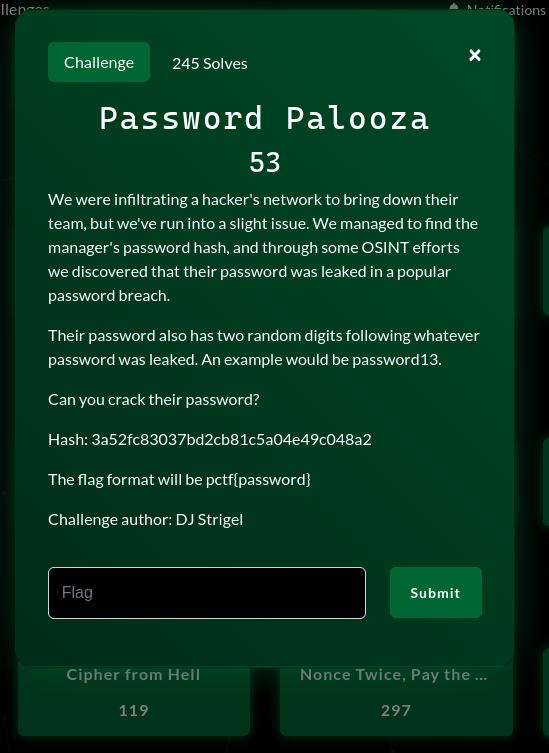
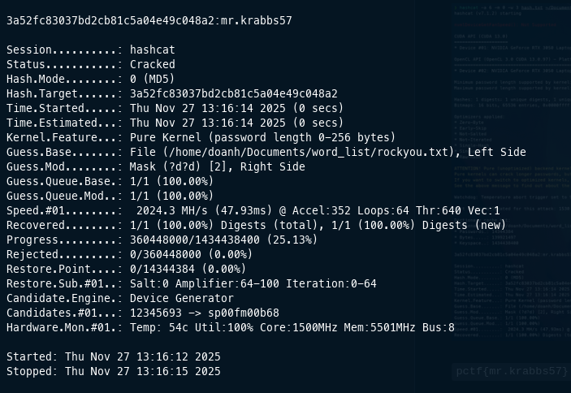

# Password Palooza

### Mô tả Challenge:

Mật khẩu gốc bị lộ trong một leak phổ biến -> rockyou.txt

Sau mật khẩu còn có thêm 2 chữ số random

flag: pctf{password}

---

### Phân tích hash:

`3a52fc83037bd2cb81c5a04e49c048a2`

Hash có độ dài 32 hex -> MD5

---

### Chiến lược giải mã:

Dùng hashcat với cú pháp như sau:

`hashcat -a 6 -m 0 -w 3 hash.txt rockyou.txt '?d?d'`

- Chế độ hash: '-m 0' (MD5)
- Chế độ tấn công: '-a 6' (dictionary + mask)
- Chế độ profile: 'w 3' (High GPU)
- Dictionary: rockyou.txt
- Mask: ?d?d

### Thực thi hashcat:

`pctf{mr.krabbs57}`
