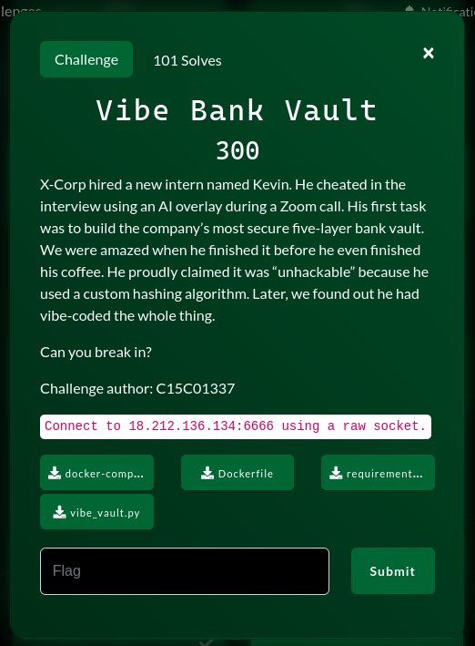

# Vibe Bank Vault



---

### Script:

```py
import base64
import re

from pwn import *

p = process("./vibe_vault_patched.py")


def solve_level1():
    # Lấy Leaked Note
    p.recvuntil(b"Leaked Note: ")
    Leaked_Note = p.recvline().strip()

    # Lấy Target Hash
    p.recvuntil(b"Target Hash: vb$1$")
    Hash = p.recvline().strip()

    decode_Hash = base64.b64decode(Hash)

    # Ghi hash decode ra hash.txt
    file_hash = "hash.txt"

    with open(file_hash, "w") as f:
        f.write(decode_Hash.decode() + "\n")

    log.info(
        "Hãy chạy lệnh sau: hashcat -a 3 -m 3200 -w 3 hash.txt '-1?l?u?d' '"
        + Leaked_Note.decode()
        + "?1?1'"
    )

    tmp = input("Vui lòng nhập 2 chữ cuối cùng: ")

    Leak = Leaked_Note + tmp.encode()

    # Gửi password
    p.sendlineafter(b"Enter password:", Leak)

    return 0


def solve_level2():
    # Lấy prefix
    p.recvuntil(b"prefix: ")
    prefix = p.recvline().strip()

    prefix = prefix[1 : len(prefix) - 1]

    # Tạo string 1
    string1 = prefix + b"A"

    # Tạo string 2
    string2 = string1 + b"B" * 0x100

    result = string1 + b"," + string2

    p.sendlineafter(b"string1,string2", result)

    return 0


def solve_level3():
    p.sendlineafter(b"password:", b"B" * 0x48)

    return 0


def solve_level4():
    icon_fire = "🔥"

    p.recvuntil(b"The target password ")
    data = p.recvline()

    match = re.search(rb"is: (\d+).*?\+ (\d+)", data)

    # Lấy pad_len và emoji_count
    pad_len = int(match.group(1))
    emoji_count = int(match.group(2))

    sum_byte = pad_len + emoji_count * 4

    # Tạo payload
    if sum_byte > 72:
        payload = pad_len * "C" + ((72 - pad_len) // 4) * icon_fire
    else:
        payload = pad_len * "C" + emoji_count * icon_fire

    p.sendlineafter(b"Enter password: ", payload.encode())

    return 0


def solve_level5():

    p.recvuntil(b'"XCORP_VAULT_ADMIN"\n')
    data = p.recvline()

    num = int(re.search(rb"\d+", data).group())

    tmp = num % 256
    if tmp == 0:
        payload = "X" * num
    else:
        payload = "X" * tmp

    p.sendlineafter(b"password:", payload.encode())

    return 0


solve_level1()
solve_level2()
solve_level3()
solve_level4()
solve_level5()

p.interactive()
```
